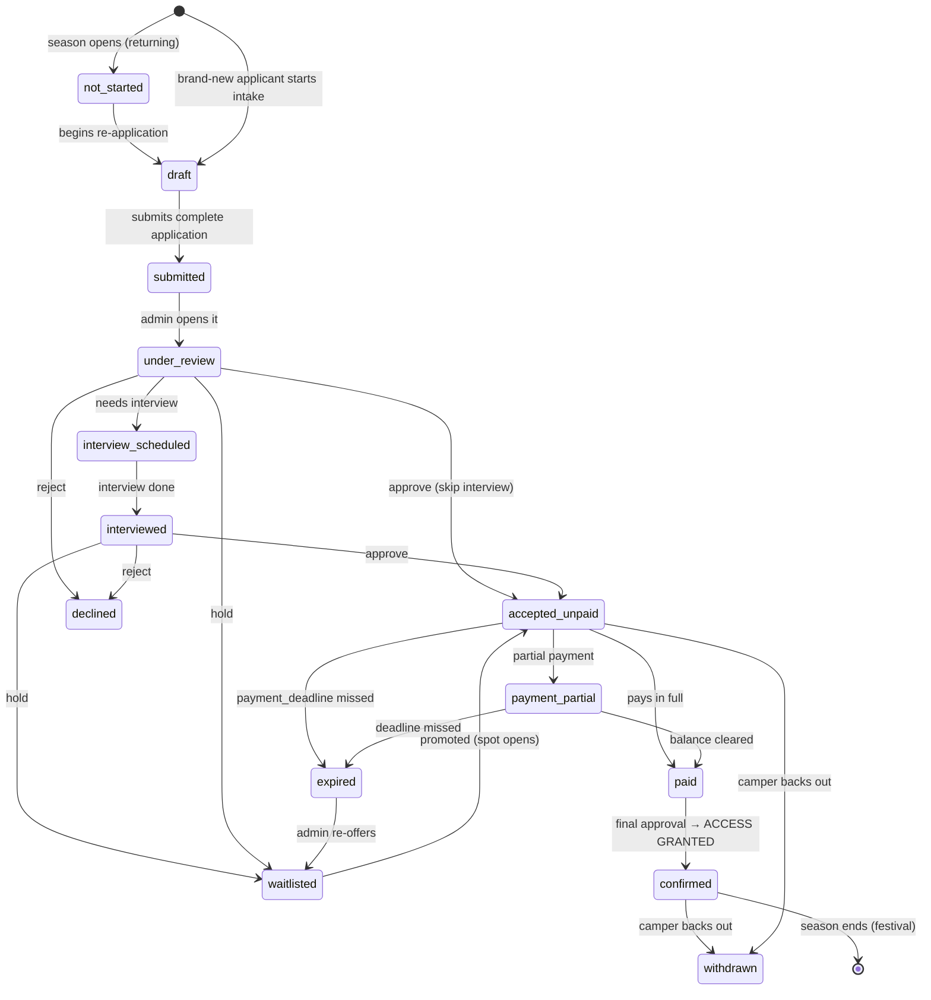
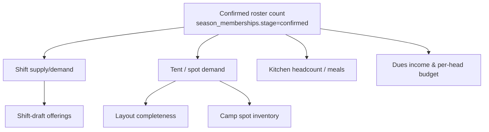
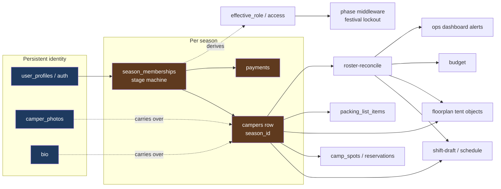

# Roster & Annual Application Lifecycle — Detailed Design

**Deep-dive companion to [DESIGN.md](DESIGN.md). Planning only — no implementation.**
Covers the persistent **Roster** workflow: application → interview → acceptance → payment →
confirmation → access, the annual **re-application** cycle, the festival **"demolition"** lockout,
and the **data-driven reconciliation** that ties roster size to shifts, tents, layout, kitchen, and budget.

> **Firewall reminder ([DESIGN.md §0.5](DESIGN.md)):** everything below has two faces. The
> **camper face** stays tiny and streamlined — *apply / re-apply, pay, see my status*. Everything
> else (pipeline, payments ledger, interviews, reconciliation) is **leadership-only**. A camper
> never sees a "state machine" or a "reconciliation deficit."

---

## 1. The core architectural move: a Season dimension

Today there is no notion of "which year." `campers` is a single flat list, and identity, profile,
and this-year logistics are fused together. To support *"everyone reapplies annually, but their
profile stays intact,"* we separate three lifespans:

| Layer | Lifespan | Where it lives today | Change |
|---|---|---|---|
| **Identity / account** | Forever (across all years) | `user_profiles` (auth `id`), `camper_photos.user_id`, `user_profiles.bio` | Keep. This is the durable person. |
| **Seasonal membership** | One year | *(does not exist)* | **New** `season_memberships` — the lifecycle state machine. |
| **Seasonal profile + logistics** | One year | `campers` (fused with identity today) | Add `season_id`; one `campers` row **per person per season**. |

### 1.1 Why this shape (aligns with how the app already works)
Every season-scoped system already keys off `campers.id`: `camp_reservations.camper_id`,
`shift_draft_*.camper_id`, `schedule_assignments.camper_id`, `packing_list_items.camper_id`,
tent sharing (`sharing_tent_with_*` → `campers.id`), and layout placement (`campers.layout_x/y`).

**Therefore:** if each season gets its own `campers` rows, *all of those systems become
season-scoped for free* — no rewrite of shifts, spots, packing, or layout linkage. This is the
minimal-churn path and the one this design recommends.

- **Persistent things** (photos, bio, the login itself) are already keyed to the **account**
  (`user_id` / `user_profiles`), so they **carry over automatically**. No migration of photos/bio.
- **Seasonal things** (shelter dims, arrival, shift prefs, tent placement, packing) live on the
  season's `campers` row and are **cloned forward** as a *starting point* when a person re-applies.

> **Alternative (purist) model:** fully normalize a durable `profiles` table vs. a seasonal
> `applications` table. Cleaner in theory, but forces rewrites across shifts/spots/layout. Rejected
> for now in favor of the season-scoped `campers` approach. Revisit only if seasonal data starts
> diverging heavily from the person.

### 1.2 New tables (additive)
```
seasons
  id, year (2026…), label, status(enum), 
  application_open_at, application_close_at,
  interview_window_start/end, payment_deadline, dues_amount_cents,
  build_week_start, burn_start, burn_end, breakdown_start, season_close,
  is_active (exactly one active season)

season_memberships              -- one row per (account × season) = "the application"
  id, season_id, account_id(->user_profiles.id), camper_id(->campers.id, this-season profile),
  stage(enum, see §2), is_returning(bool), waitlist_rank,
  interview_at, interview_by, interview_notes,
  decided_at, decided_by, decline_reason,
  access_granted_at, withdrawn_at,
  source(new|reapply), created_at, updated_at

payments                        -- supports partial/multiple payments per membership
  id, membership_id, amount_cents, method(enum: stripe|venmo|cash|zelle|comp|other),
  status(enum: pending|received|refunded|failed), paid_at, recorded_by,
  external_ref, notes, created_at

roster_notifications            -- audit + in-app feed (email send is a side-effect)
  id, membership_id, account_id, kind(enum, see §7), channel(email|in_app),
  sent_at, payload(jsonb), read_at
```
`campers` gains: `season_id` (FK), and optionally `carried_from_camper_id` (provenance of a
cloned re-application). `user_profiles.role` stays but is **derived** from the active season's
membership stage (§2.3), not set ad-hoc.

---

## 2. The application lifecycle state machine

`season_memberships.stage` is the single source of truth for where a person is this year.

### 2.1 States


### 2.2 Transition table (trigger · actor · side-effects)
| From → To | Trigger | Actor | Side-effects |
|---|---|---|---|
| →`draft` | start/reapply | camper | clone prior `campers` row if returning |
| `draft`→`submitted` | submit | camper | notify admins; validate completeness |
| `submitted`→`under_review` | open | admin | AI applicant summary (reuse [applicant-summary route](src/app/api/ai/applicant-summary/route.ts)) |
| →`interview_scheduled` | schedule | admin | notify camper (date/time) |
| →`accepted_unpaid` | approve | admin | notify camper **with dues + deadline**; create `payments` due row |
| `*`→`paid`/`payment_partial` | record/receive payment | admin or Stripe webhook | update ledger; receipt notification |
| `paid`→`confirmed` | final approve | admin | **grant access** (role→`user`/`builder`); welcome notification; count toward roster |
| →`waitlisted` | hold | admin | notify; set `waitlist_rank` |
| →`declined` | reject | admin | notify; snapshot to `archived_applicants` (reuse existing table) |
| →`expired` | deadline cron | system | notify; auto-offer waitlist next in rank |
| →`withdrawn` | back out | camper/admin | free their tent spot + shift slots (reconciliation §6) |

### 2.3 Access is a *projection* of stage (not set by hand)
Access/role is derived so it can never drift from the lifecycle:
```
effective_role(account, active_season) =
  admin            if user_profiles.is_admin
  builder          if membership.stage == confirmed AND builder-flagged
  user             if membership.stage == confirmed
  pending          otherwise (draft/submitted/…/accepted_unpaid/paid)
  (no access)      if declined/expired/withdrawn OR no membership this season
```
This means: **paying is not enough — `confirmed` (paid + final approval) is what unlocks the
account.** Exactly the requested flow. During Festival, this projection is overridden (§5).

---

## 3. Payment & dues tracking

- Dues config lives on `seasons` (`dues_amount_cents`, `payment_deadline`). Supports comps/scholarships via a `comp` payment method or per-membership override.
- **Partial payments** are first-class: multiple `payments` rows sum toward `dues_amount_cents`.
  `amount_paid = Σ received`; `balance = dues − amount_paid`; stage advances to `paid` when balance ≤ 0.
- **Two capture modes**, both supported:
  1. **Manual ledger** — admin records Venmo/Cash/Zelle with date, amount, ref, note. (Ship first — zero external deps.)
  2. **Stripe** *(optional, later)* — hosted checkout link in the acceptance email; webhook writes a `payments` row and advances stage automatically.
- Every payment writes a notification (receipt) and appears in the admin ledger + the camper's status page ("Paid $X of $Y · balance $Z · due by DATE").
- **Deadline engine:** a scheduled job (or on-load check) flags memberships whose `payment_deadline`
  passed while unpaid → `expired`, and surfaces "approaching deadline" milestones at T-7 / T-2 / T-0.

---

## 4. Camper-facing surface (kept tiny — firewall)

The only things a camper ever sees of this whole system:

| Camper sees | Where | Notes |
|---|---|---|
| "Apply / Re-apply for {year}" | reuse [intake flow](src/app/intake/page.tsx), prefilled if returning | one CTA |
| Application status | [pending page](src/app/pending/page.tsx) evolves into a status view | "Submitted → Interview → Accepted → Pay → Confirmed" progress |
| Pay dues + see balance | new lightweight panel on status page | manual instructions or Stripe link |
| Their profile carried over | [profile](src/app/profile/page.tsx) | photos/bio already persist |

No pipeline, no ledger, no reconciliation, no "stages" vocabulary. Status is shown as a friendly
5-step progress bar, not the internal enum.

---

## 5. The Festival "Demolition" (ceremonial lockout → admin-only)

Driven entirely by the **Phase Engine** ([DESIGN.md §5.2](DESIGN.md)); no manual toggling required,
but an admin override exists.

**Behavior when `phase == festival` (or `season.status == festival_lockout`):**
- **Access projection is overridden:** every non-admin `effective_role` → **locked**. `builder`/`user`
  sessions hit a themed **"The app has been ceremonially demolished for the Burn 🔥"** screen —
  read-only nothing; go be present.
- **App becomes admin-only reference mode** — admins retain full access (maps, directory, kitchen,
  contacts) for on-playa reference.
- Enforced in one place: Next.js **middleware** ([src/proxy.ts](src/proxy.ts) / middleware) checks
  `effective_role` + current phase before rendering any camper route. Single choke point = easy to test.

**On season rollover (next year opens):**
- New season row created; `status` → `application_open`.
- **All prior memberships do NOT carry** — everyone is back to *no active membership* → must re-apply.
- **But identity, login, photos, and bio persist** → re-engagement is one click ("Re-apply, we kept your stuff").
- **Archive the closing season first:** snapshot that year's published **kitchen schedule** and
  **build schedule** (with camper names) to view-only images in Resources → "Past Years"
  ([DESIGN.md §4.1](DESIGN.md)) *before* the new season begins, so history is preserved immutably.

This literally implements: *disable during festival → admin-only → next year everyone re-applies,
pays, is approved, but their profile is intact.*

---

## 6. Data-driven reconciliation (the connective tissue)

This is the "data drives data drives workflows" core. The **confirmed roster count** is the master
signal; several derived reconciliations hang off it. Model as a pure engine
(`src/lib/roster-reconcile.ts`) mirroring the existing [layout-sync.ts](src/lib/layout-sync.ts) pattern
(audit → deltas → suggested actions), surfaced as Ops-Dashboard alerts/milestones.



### 6.1 Roster → Shifts (`reconcileShifts`)
- Demand = Σ required coverage across `kitchen_shifts` for the week (min/max per role).
- Supply = confirmed campers × per-camper shift target (config).
- Output: *"52 confirmed campers · 118 shift-slots needed · at 2.5 shifts/camper you can cover 130 →
  surplus 12"* or a **deficit alert** → "recruit N more or cut M shifts." Feeds the shift-draft
  offerings editor ([offerings-editor.tsx](src/app/admin/shift-draft/offerings-editor.tsx)).
- Also: *unassigned confirmed campers* who haven't ranked → nudge list.

### 6.2 Roster → Tents/Spots → Layout (`reconcileTents`)
Three counts that must agree, with deltas:
1. **Need:** confirmed campers requiring shelter, minus tent-sharing (`sharing_tent_with_*`) so a
   shared tent counts once → *distinct tents needed*, bucketed by size (`shelter_width/length_ft`).
2. **Spots:** `camp_spots` available, with size fit (`min/max_tent_width/length_ft`) and
   `max_occupants` for sharing.
3. **Layout objects:** `floorplan_objects` of type `tent` on the active floorplan.
- Output: *"48 distinct tents needed · 45 spots defined (3 short) · 41 tent objects on layout (7
  missing) · 2 oversized tents with no fitting spot."* Each delta is actionable and can auto-suggest
  creating spots/objects (reuse [layout-sync.ts](src/lib/layout-sync.ts) generation).
- Withdrawals/declines free spots and shift slots automatically (stage transition side-effect §2.2).

### 6.3 Roster → Kitchen headcount & Budget
- Headcount → meal-count estimates for kitchen planning; per-head consumables.
- Dues income = confirmed × `dues_amount_cents` (+ actual from `payments`); feeds Budget workflow
  ([DESIGN.md §4](DESIGN.md), item #3). Shows *projected vs. collected*.

### 6.4 Surfacing
Each reconciliation result becomes a **milestone/alert** on the leadership dashboard
([DESIGN.md §6.1](DESIGN.md)) — "Now / Overdue / Approaching" — e.g. *"Tent layout 7 short of roster
(due before spot selection opens)."* Data changes → signal recomputes → dashboard/workflow updates.
That is the self-driving loop.

---

## 7. Notifications

Lifecycle transitions and deadlines emit notifications (write `roster_notifications`, optionally send
email). Kinds:
`submitted_ack`, `interview_scheduled`, `accepted_pay_now`, `payment_received`,
`deadline_T7/T2/T0`, `expired`, `waitlist_promoted`, `confirmed_welcome`, `withdrawn_ack`,
`season_open_reapply`.

- **In-app** feed always works (no external dep).
- **Email** requires a transport — *there is no email sender in the app today* → **gap to fill**
  (e.g. Resend/Supabase SMTP). Check `.env.local` for existing keys before adding one.
- Templates configurable by admins (reuse the `resource_edits`/settings editing pattern).

---

## 8. Admin cockpit (leadership-only)

Extends the current [admin/applicants page](src/app/admin/applicants/page.tsx) into a full pipeline:

- **Pipeline board (kanban):** columns = stages (§2.1); cards = applicants; drag to transition
  (with confirmation + side-effects). Reuse the shift-draft/kanban UI primitives where possible.
- **Applicant drawer:** profile, AI summary, interview notes/scheduler, payment ledger, history.
- **Payments ledger view:** record payment, see balances, export.
- **Reconciliation panel:** live roster stats + shift/tent/budget deltas (§6) with one-click
  "create missing spots / objects / open more shifts."
- **Bulk actions:** accept N, send deadline reminders, promote waitlist.
- **Season controls:** open/close application, set dues + deadline, trigger rollover, festival lockout override.

---

## 9. Roster migration sub-waves

Fits inside the master plan ([DESIGN.md §8](DESIGN.md)); all additive, current data preserved.

| Sub-wave | Delivers | Notes |
|---|---|---|
| **R0 — Schema** | `seasons`, `season_memberships`, `payments`, `roster_notifications`; `campers.season_id` | Backfill: create season **2026**, wrap every existing camper as a `confirmed` membership. Zero user-visible change. |
| **R1 — Lifecycle + pipeline** | stage machine + derived access projection + admin kanban | Replaces ad-hoc approve/deny with stages; reuse applicants page. |
| **R2 — Payments** | dues config, manual ledger, balances, deadline engine, camper pay panel | Stripe optional/later. |
| **R3 — Festival lockout** | phase-gated middleware + ceremonial demolition screen + admin-only mode | Single choke point; testable. |
| **R4 — Re-application** | season rollover, clone-forward profile, "Re-apply" CTA, carryover of photos/bio | Closes the annual loop. |
| **R5 — Reconciliation** | `roster-reconcile.ts`: shifts, tents/spots/layout, kitchen, budget deltas → dashboard alerts | The self-driving connective layer. |

**Firewall gate on every sub-wave:** run the [DESIGN.md §0.5.3](DESIGN.md) camper acceptance test.
A `user` still only sees apply/status/pay/profile — never the pipeline or reconciliation.

---

## 10. Open questions
1. **Payments:** ship manual ledger only first, or wire Stripe from the start? (Recommend manual first.)
2. **Email transport:** which provider? Any key already in `.env.local`? (Blocks R2 email; in-app works regardless.)
3. **Interviews:** in-app scheduler, or just record notes + external calendar? (Recommend notes-first.)
4. **Waitlist promotion:** automatic by rank on expiry/withdrawal, or admin-manual? 
5. **One `campers` row per season** (recommended) vs. normalize durable-vs-seasonal profile — confirm the season-scoped approach.
6. **Data retention:** how long to keep non-returning people's seasonal data / PII?
7. **Builder status:** re-earned each season, or sticky for returning trusted builders?
8. **Dues variations:** flat, or tiers (early-bird, scholarship, comp)?

---

## 11. Connection summary (one picture)

